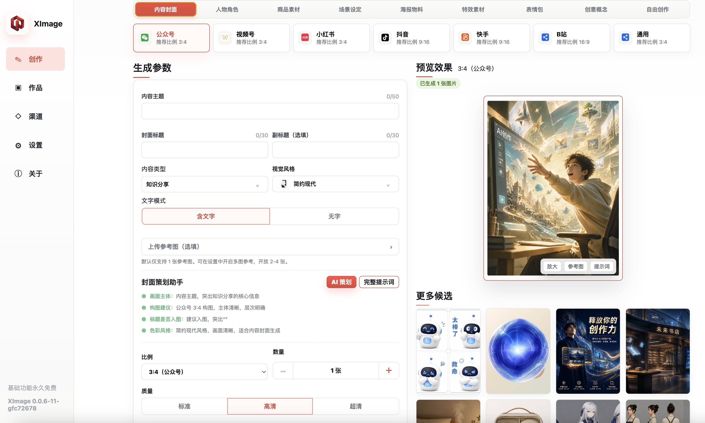
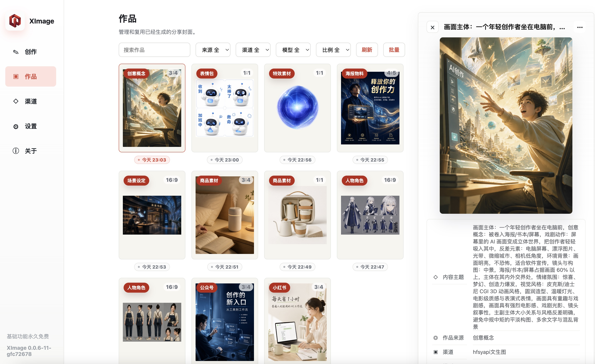
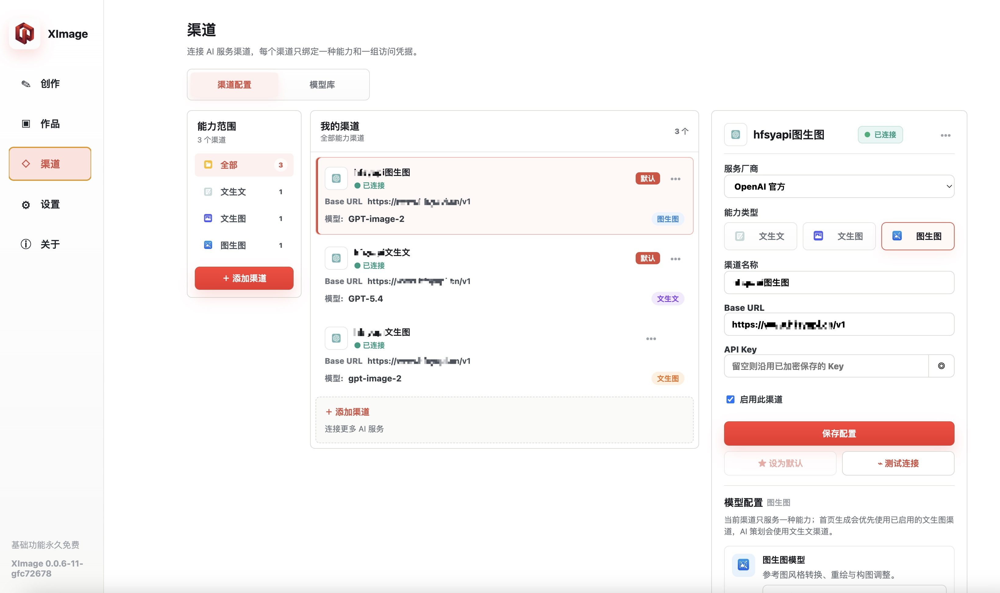
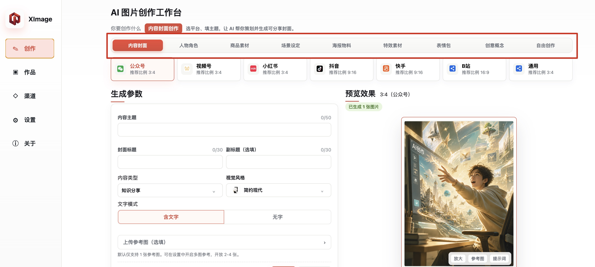

<!--
  这是「公开仓 EgoMatrix/XImage」使用的 README。
  发布时由 scripts/sync-public-docs.sh 同步覆盖公开仓根目录的 README.md。
  请勿在本文件中暴露：
    - 内部仓库路径 / 用户名
    - AGENTS.md / CLAUDE.md / doc/context / docs/technical 的存在
    - 源码结构、技术栈选型细节
    - 构建脚本与开发命令
-->

  

<h1 align="center">XImage</h1>

  本地优先的跨平台 AI 生图桌面客户端 · 免费下载使用

  
  
  
  

  <a href="#-下载安装">下载</a> ·
  <a href="docs/user-guide.md">使用手册</a> ·
  <a href="docs/faq.md">常见问题</a> ·
  <a href="docs/changelog.md">更新日志</a> ·
  <a href="#-反馈与支持">反馈</a>

---

## ✨ XImage 是什么

XImage 是一个**本地优先的 AI 生图桌面客户端**，把分散在不同渠道、不同模型的图片生成能力整合到一个统一界面里。

- **不依赖在线账号**：API Key、生成历史、图片文件全部存在你自己的电脑上。
- **不绑定特定模型**：OpenAI、Google、字节、MiniMax、Kimi、以及任何兼容渠道都可以接入。
- **不堆叠复杂参数**：用「选模式 → 填主题 → 生成」三步覆盖 90% 的日常生图需求。
- **不强制付费**：基础功能永久免费，作者通过赞助二维码维持长期维护。

> 适合内容创作者、电商运营、设计师、学生、独立开发者，以及任何「有 API Key 但不想用网页版」的人。

## 🎨 九大创作模式

| 模式 | 适用场景 |
|---|---|
| **内容封面** | 小红书、抖音、公众号、视频号等分发平台的封面图 |
| **人物角色** | 角色设定表、多角度转身、表情组、姿态组、头像组 |
| **商品素材** | 电商主图、详情卖点图、场景种草图、包装展示图 |
| **场景设定** | 空间、环境、世界观、镜头场景，适合方案与故事设定 |
| **海报物料** | 活动宣传、品牌海报、课程招生、节日海报、社群招募 |
| **特效素材** | 光效粒子、烟雾火焰、科技 HUD、爆炸碎片等合成资产 |
| **表情包** | 聊天表情、贴纸、梗图角色，单图或九宫格 |
| **创意概念** | mini-me、巨人国、真人 + 卡通混搭等戏剧感画面 |
| **自由创作** | 直接描述想象中的画面，适合实验性灵感和概念图 |

每个模式都有专属的字段表单和 AI 提示词策划助手，详细用法见 [使用手册](docs/user-guide.md)。

## 📸 截图

<table>
  <tr>
    <td></td>
    <td></td>
  </tr>
  <tr>
    <td align="center">生图工作台</td>
    <td align="center">生图记录与复用</td>
  </tr>
  <tr>
    <td></td>
    <td></td>
  </tr>
  <tr>
    <td align="center">渠道与模型管理</td>
    <td align="center">九大创作模式</td>
  </tr>
</table>

## 📦 下载安装

请到 [Releases 页面](https://github.com/EgoMatrix/XImage/releases/latest) 下载与你系统匹配的安装包：

| 系统 | 安装包 | 说明 |
|---|---|---|
| macOS（Apple Silicon） | `XImage-<version>-mac-arm64.dmg` | M1/M2/M3/M4 系列 |
| macOS（Intel） | `XImage-<version>-mac-x64.dmg` | 2020 及之前的 Intel Mac |
| Windows | `XImage-<version>-win-x64.exe` | Windows 10/11 64 位 |
| Linux | `XImage-<version>-linux-x64.AppImage` | 大多数主流发行版 |

### 首次启动可能遇到的安全提示

- **macOS**：首次打开会提示「无法验证开发者」，请右键 → 打开，或前往「系统设置 → 隐私与安全性」放行。详见 [使用手册 · 安装与启动](docs/user-guide.md#安装与启动)。
- **Windows**：SmartScreen 可能提示「Windows 已保护你的电脑」，点击「更多信息 → 仍要运行」。
- **Linux**：AppImage 下载后需要 `chmod +x` 才能运行。

> 应用本身完全离线工作，下载后不联网也能完成除「调用图片生成接口」以外的所有操作。

## 🚀 5 分钟跑通第一张图

1. **配置一个渠道**：打开「渠道设置」→ 新增渠道 → 填入 Base URL 与 API Key → 测试连接。
2. **启用一个模型**：进入「模型管理」→ 启用一个图片生成模型。
3. **生成第一张图**：回到首页 → 选择「内容封面」模式 → 填主题与标题 → 点「生成封面」。
4. **保存与复用**：在「生图记录」可以放大、保存到本地、或一键复用提示词重新生成。

完整步骤、截图与排错说明见 [使用手册 · 5 分钟跑通第一张图](docs/user-guide.md#5-分钟跑通第一张图)。

## 📚 文档

- [使用手册](docs/user-guide.md) —— 完整功能讲解、每个创作模式的最佳实践
- [常见问题](docs/faq.md) —— 连接、模型、保存、迁移、隐私相关
- [更新日志](docs/changelog.md) —— 每个版本的变化摘要
- [详尽版用户指南（飞书文档）](https://example.feishu.cn/docx/xxxxxxx) —— 含视频、动图、社群答疑（链接发布后替换）

## 🔐 隐私说明

- **API Key**：本地加密存储，永远不会上传到 XImage 的任何服务器，因为 XImage 本身就没有服务器。
- **生成历史**：默认保存在本地 SQLite 中，可随时清除或迁移。
- **图片文件**：默认保存到你指定的本地目录，不会自动上传任何云端。
- **使用统计**：默认关闭。

## 💬 反馈与支持

- **报 Bug / 提建议**：欢迎到 [Issues](https://github.com/EgoMatrix/XImage/issues) 提交。
- **使用咨询**：加入交流群（二维码在 [使用手册](docs/user-guide.md#反馈渠道)）。
- **联系作者**：见 [使用手册 · 反馈渠道](docs/user-guide.md#反馈渠道)。

## ☕ 赞助

如果 XImage 帮你省下了时间，欢迎请作者喝杯咖啡——这是项目长期维护的主要动力。

赞助二维码与鸣谢名单见 [使用手册 · 赞助](docs/user-guide.md#赞助)。

## 📄 许可与说明

- 本仓库内**所有文档与图片**以 [Creative Commons Attribution 4.0 (CC-BY-4.0)](LICENSE-DOCS) 授权，欢迎转载、引用、改编，注明出处即可。
- **软件本身（应用程序）保留所有权利**：允许个人与团队**免费下载、安装、使用**（含商业场景下的内部使用），但不开放源代码，且不允许二次分发、反编译、移除版权信息。
- 本仓库**不包含源代码**。代码相关的 Issue 与 PR 暂不受理，欢迎通过 Issue 反馈功能与体验问题。

---

  XImage · 让 AI 生图回归简单

